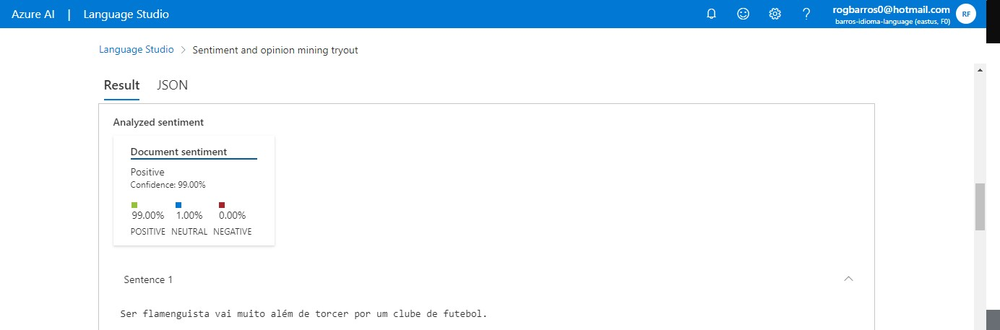

# dio-lab-language-services

O Azure AI Language Studio é uma plataforma poderosa que oferece uma ampla gama de insights e possibilidades de uso para várias aplicações de processamento de linguagem natural (PLN). Aqui estão alguns insights e possibilidades de uso:

1. **Geração de Texto**: O Language Studio pode ser usado para gerar texto automaticamente com base em entradas fornecidas. Isso pode ser útil para gerar resumos automáticos de texto, criar conteúdo para chatbots ou sistemas de recomendação de produtos.

2. **Análise de Sentimento**: Com algoritmos avançados de PLN, o Language Studio pode analisar o sentimento expresso em textos, como em comentários de clientes, avaliações de produtos ou postagens em redes sociais. Isso pode ajudar as empresas a entender melhor a percepção do cliente e responder de forma proativa a feedbacks negativos.

Analisando sentimentos a partir do texto.

1. Entre Azure AI Language Studio
2. Procure por Classify text
3. Depois por Analyse sentiment and mine opinions
4. Marque a opção I acknowledge that...
5. Faça o upload do texto que desejada
6. Verifique o resultado

3. **Extração de Informações**: O Language Studio pode extrair informações importantes de documentos ou textos, como datas, números, entidades nomeadas (como pessoas, locais e organizações), entre outros. Isso é útil para tarefas de indexação, classificação e organização de documentos.

4. **Tradução Automática**: Com a capacidade de tradução automática de alta qualidade, o Language Studio pode ser usado para traduzir texto entre vários idiomas. Isso é útil para empresas que precisam lidar com conteúdo multilíngue em seus produtos e serviços.

5. **Reconhecimento de Entidades Nomeadas (NER)**: O Language Studio pode identificar e classificar entidades nomeadas em textos, como nomes de empresas, pessoas, datas, locais, etc. Isso é útil em aplicativos de extração de informações, análise de conteúdo e indexação de documentos.

6. **Classificação de Texto**: O Language Studio pode classificar textos em categorias predefinidas com base em seu conteúdo. Por exemplo, ele pode ser usado para categorizar e filtrar e-mails, avaliações de produtos ou artigos de notícias em diferentes temas ou tópicos.

7. **Geração de Respostas Automáticas**: Com base em perguntas recebidas, o Language Studio pode gerar respostas automáticas relevantes. Isso é útil em sistemas de suporte ao cliente, onde respostas automáticas podem lidar com consultas comuns de maneira eficiente.

8. **Sumarização de Texto**: O Language Studio pode resumir textos longos em versões mais curtas e concisas, mantendo as informações mais relevantes. Isso é útil para análise de grandes volumes de dados textuais ou para fornecer resumos automáticos de artigos e documentos.

Essas são apenas algumas das muitas possibilidades de uso do Azure AI Language Studio. Com seu poderoso conjunto de ferramentas de PLN, é uma plataforma versátil que pode ser aplicada em uma ampla variedade de cenários e setores, desde atendimento ao cliente até análise de dados e muito mais.